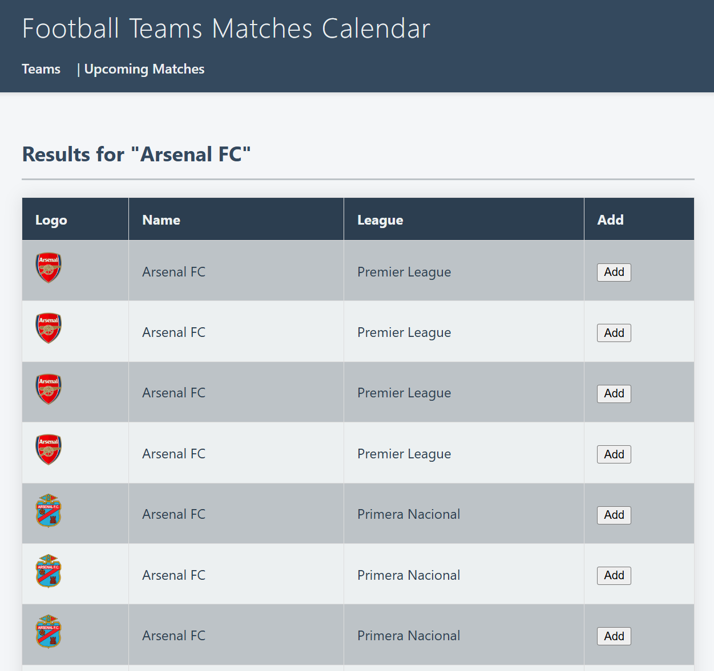

# Teams Matches Calendar
Simple Django app for collecting matches dates.
Initially it was databse-driven, but now I'm using cookie for storage, 
making it usable by anyone without user management.

- Find a team and add it to cookie storage
- Find upcoming matches of all added teams
- Add matches to a Google Calendar, using provided CalendarID or 'primary' as a default

Also, next step is to containerize it for simple deployment.

