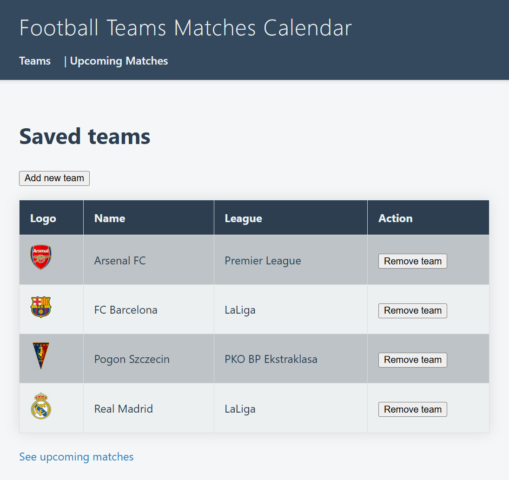
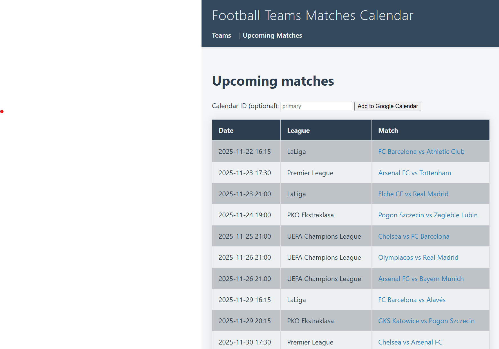

# Teams Matches Calendar
Simple Django app for collecting matches dates.

- Find a team and add it to database
- Find upcoming matches of all added teams
- Add matches to a Google Calendar

For now, Calendar ID is in config, but I want to move it into a session - and the same is for teams. Store all user preferences in session cookies, so it can become a real general app, without personalization.

Also, next step is to containerise it for simple deployment.

